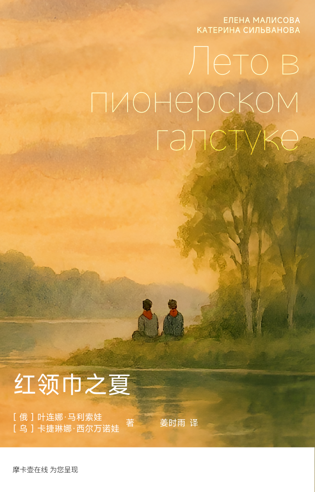

# 红领巾之夏

1986年，16岁的少先队员尤拉因参加苏联夏令营而认识了隔壁班的18岁大学生辅导员沃洛佳，二人随后秘密度过了难忘的夏天却不幸失去联系。二十年后苏联早已解体，移民去他国的尤拉独自回到这片早已成为废墟的营区，挖掘出当年二人一齐埋下的时间胶囊，试图寻找过去的蛛丝马迹和离别初恋的音讯……

## 版权信息

作者：［乌］卡捷琳娜·西尔万诺娃、［俄］叶连娜·马利索娃  
翻译：姜时雨  
校对：［加］米拉·利亚多娃、张哲睿  
电子出版：摩卡壶在线

Спасибо всем, кто сделал это возможным.
